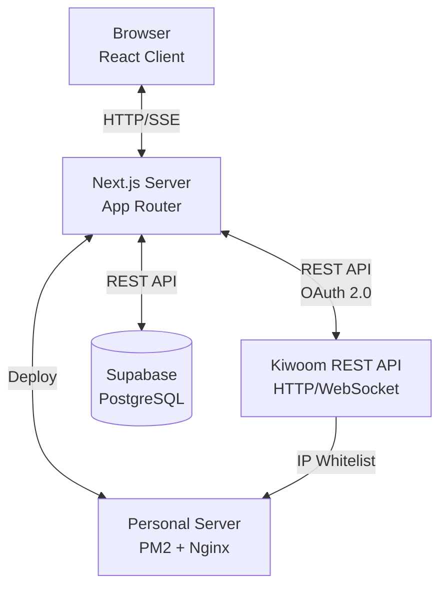

# 시스템 아키텍처

## 전체 구조



## 프로젝트 구조

### Next.js App Router 구조

```
stock-trading-platform/
├── src/
│   ├── app/                    # Next.js App Router
│   │   ├── (auth)/            # 인증 그룹
│   │   │   ├── login/
│   │   │   └── layout.tsx
│   │   ├── (trading)/         # 트레이딩 그룹
│   │   │   ├── trade/
│   │   │   ├── portfolio/
│   │   │   └── layout.tsx
│   │   ├── api/               # Route Handlers (Backend API)
│   │   │   ├── auth/
│   │   │   ├── order/
│   │   │   ├── account/
│   │   │   └── realtime/
│   │   ├── layout.tsx         # 루트 레이아웃
│   │   └── page.tsx           # 홈 페이지
│   │
│   ├── widgets/               # FSD: 위젯 레이어
│   ├── features/              # FSD: 기능 레이어
│   ├── entities/              # FSD: 엔티티 레이어
│   └── shared/                # FSD: 공통 레이어
│
└── document/                  # 문서
```

## Frontend (Next.js Client)

### FSD 아키텍처

Feature-Sliced Design으로 구조화:

```
app → widgets → features → entities → shared
```

| 레이어 | 설명 | 예시 |
|:-------|:-----|:-----|
| `app/` | Next.js App Router | 라우팅, 레이아웃 |
| `widgets/` | 복합 위젯 | ChartWidget, OrderWidget |
| `features/` | 기능 | placeOrder, fetchAccount |
| `entities/` | 비즈니스 엔티티 | stock, account |
| `shared/` | 공통 | ui, lib, api, types |

**규칙**: 상위 레이어는 하위 레이어만 import 가능

**상세 폴더 구조**: [development.md - 디렉토리 구조](./development.md#디렉토리-구조)

### Server Components vs Client Components

| Server Component (기본) | Client Component (`'use client'`) |
|:------------------------|:-----------------------------------|
| 데이터 페칭, DB 접근     | 인터랙션 (onClick, onChange)       |
| 민감한 정보 처리         | 상태 관리 (useState, useReducer)   |
| 번들 크기 감소           | Effect (useEffect)                 |
| SEO 최적화               | 브라우저 API (window, localStorage) |

**상세 규칙 및 예시**: [coding-standards.md](./coding-standards.md#server-component-vs-client-component)

### 상태 관리

- **Zustand**: 클라이언트 전역 상태 (계좌 정보, UI 상태)
- **TanStack Query**: 서버 상태 (API 캐싱, 동기화, 재검증)
- **Server State**: Server Components에서 직접 데이터 페칭

## Backend (Next.js Server)

### Route Handlers

Next.js App Router의 `app/api/*/route.ts`에서 백엔드 API 구현:

```
src/app/api/
├── auth/route.ts          # POST /api/auth (로그인)
├── order/route.ts         # POST /api/order (주문)
├── account/route.ts       # GET /api/account (계좌 조회)
├── realtime/route.ts      # GET /api/realtime (SSE)
└── webhook/route.ts       # POST /api/webhook (웹훅)
```

**상세 구현 방법**:
- [coding-standards.md - Route Handler 규칙](./coding-standards.md#route-handler)
- [api-guide.md - 키움 API 연동 예시](./api-guide.md#nextjs-구현-예시)

### Server Actions

- `'use server'` directive로 서버 함수 정의
- Form 제출, 데이터 변경 작업에 사용
- `revalidatePath`/`revalidateTag`로 캐시 무효화

**상세 구현 방법**: [coding-standards.md - Server Actions](./coding-standards.md#server-actions)

## 실시간 데이터 (Server-Sent Events)

키움 WebSocket → Next.js SSE → 브라우저

- Route Handler에서 키움 WebSocket 연결
- ReadableStream으로 SSE 변환
- 클라이언트에서 EventSource로 수신

## Database (Supabase)

### 주요 테이블

| 테이블           | 설명             |
| :--------------- | :--------------- |
| `accounts`       | 거래 계좌        |
| `orders`         | 주문 내역        |
| `positions`      | 보유 포지션      |
| `price_history`  | 가격 이력        |
| `watchlist`      | 관심 종목        |

## 키움 REST API 연동

- OAuth 2.0 인증 (App Key/Secret)
- Access Token 발급 및 캐싱
- Rate Limiting (1초 20회)

자세한 내용: [키움 REST API 사용법](./api-guide.md)

## 배포 전략

- **Docker + Next.js Standalone** 방식
- Multi-stage build로 최적화된 이미지 생성
- 개인 서버 또는 클라우드에 배포

**상세 설정 방법**: [setup.md - Docker 환경 설정](./setup.md#docker-환경-설정)

## 보안

- 환경 변수로 민감 정보 관리 (.env)
- Middleware로 API 보호
- Rate Limiting (키움 API: 1초 20회)

## 성능 최적화

- Server Components 우선 사용
- Next.js Image 최적화
- 동적 import (Code Splitting)
- Route Segment Config (revalidate)

## 관련 문서

- [setup.md](./setup.md) - 설치 및 환경 설정
- [development.md](./development.md) - FSD 상세 구조 및 개발 가이드
- [coding-standards.md](./coding-standards.md) - 코딩 규칙
- [api-guide.md](./api-guide.md) - 키움 REST API 사용법
- [index.md](./index.md) - 전체 문서 목록
